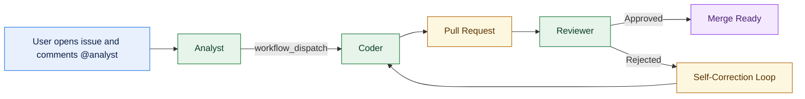
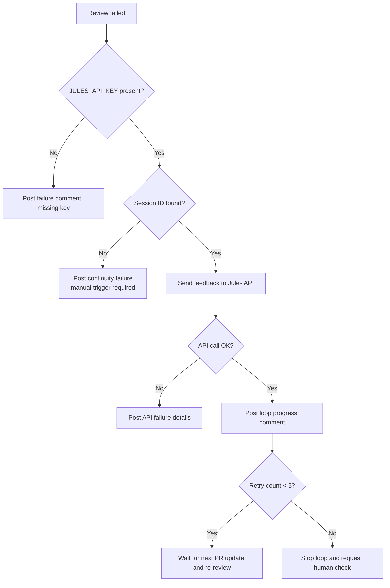

# HiveMind Actions

Serverless multi-agent automation for GitHub Actions: Analyst plans, Coder implements, Reviewer verifies, and self-correction closes the loop.

## Quick Links

- Repository: https://github.com/BUZASLAN128/HiveMind-Actions
- Actions: https://github.com/BUZASLAN128/HiveMind-Actions/actions
- Analyst Workflow: https://github.com/BUZASLAN128/HiveMind-Actions/actions/workflows/agent-analyst.yml
- Coder Workflow: https://github.com/BUZASLAN128/HiveMind-Actions/actions/workflows/agent-coder.yml
- Reviewer Workflow: https://github.com/BUZASLAN128/HiveMind-Actions/actions/workflows/agent-reviewer.yml
- Releases: https://github.com/BUZASLAN128/HiveMind-Actions/releases
- Latest Tag: https://github.com/BUZASLAN128/HiveMind-Actions/releases/tag/v2.1.1

## What It Does

HiveMind Actions turns a repository into an autonomous collaboration flow:

- Analyst converts issue intent into implementable plans.
- Coder executes the plan and opens/updates PRs.
- Reviewer checks code quality, security, and project rules.
- Reviewer can trigger self-correction when PR quality is insufficient.

## Visual Flow

```mermaid
flowchart LR
    U[User opens issue and comments @analyst] --> A[Analyst]
    A -->|workflow_dispatch| C[Coder]
    C --> PR[Pull Request]
    PR --> R[Reviewer]
    R -->|Approved| M[Merge Ready]
    R -->|Rejected| L[Self-Correction Loop]
    L --> C

    classDef actor fill:#E8F0FE,stroke:#1A73E8,color:#0B1F44;
    classDef bot fill:#E6F4EA,stroke:#137333,color:#0B3D20;
    classDef gate fill:#FEF7E0,stroke:#B06000,color:#5A3200;
    classDef done fill:#F3E8FD,stroke:#9334E6,color:#4A1F75;

    class U actor;
    class A,C,R bot;
    class PR,L gate;
    class M done;
```

## Reliability and Retry Model

| Component | Retry Strategy | Max Retry | Backoff | Notes |
|---|---|---|---|---|
| Core retry helper (`ai_utils.with_retry`) | Exponential + jitter | 3 (default) | `base_delay=1.0s` | Rate-limit aware (minimum `5s` delay on 429-like errors) |
| Analyzer model call (`swarm_analyzer.py`) | Uses core helper | 3 | Exponential | Fails hard after all attempts |
| Reviewer model call (`swarm_reviewer.py`) | Uses core helper | 5 | Exponential | More aggressive retry for review stability |
| Reviewer self-correction loop (`agent-reviewer.yml`) | Loop guard | 5 | Per-review cycle | Stops loop and asks human intervention after limit |
| Config baseline (`.github/config.json`) | Shared defaults | 3 | `base_delay=1.0s` | Includes `rate_limit_delay=5.0s` |

## Exit and Failure Semantics

| Layer | Success | Failure Exit/Status | What happens next |
|---|---|---|---|
| Python scripts (`swarm_analyzer.py`, `swarm_reviewer.py`) | process exit `0` | `sys.exit(1)` on fatal parse/runtime/config errors | Workflow step fails and error is logged |
| Workflow jobs | Green check | Red failed step/job | GitHub Actions marks run failed |
| Self-correction loop | PR converges | Rejected 5 times or missing session/key | Loop stops, issue/PR comment requests manual action |

## Error Recovery Design

```mermaid
flowchart TD
    S[Review failed] --> K{JULES_API_KEY present?}
    K -- No --> E1[Post failure comment: missing key]
    K -- Yes --> Q{Session ID found?}
    Q -- No --> E2[Post continuity failure<br/>manual trigger required]
    Q -- Yes --> T[Send feedback to Jules API]
    T --> O{API call OK?}
    O -- No --> E3[Post API failure details]
    O -- Yes --> N[Post loop progress comment]
    N --> R{Retry count < 5?}
    R -- Yes --> W[Wait for next PR update and re-review]
    R -- No --> E4[Stop loop and request human check]
```

## 1-Minute Quickstart

1. Copy these paths into your repository:
   - `.github/workflows/`
   - `.github/scripts/`
   - `.github/prompts/`
   - `.github/swarm_rules.md`
   - `.github/config.json`
2. Add required secrets and variables in `Settings -> Secrets and variables -> Actions`.
3. Create an issue and comment `@analyst`.
4. Analyst runs, dispatches Coder (`workflow_dispatch`), Coder opens PR, Reviewer evaluates PR.

## Configuration Matrix (Source of Truth)

### Secrets and Variables

| Name | Required | Used By | Purpose |
|---|---|---|---|
| `GLM_API_KEY` | Yes (if provider=`glm`) | `agent-analyst.yml`, `agent-reviewer.yml` | GLM provider access |
| `GEMINI_API_KEY` | Yes (if provider=`gemini`) | `agent-analyst.yml`, `agent-reviewer.yml` | Gemini provider access |
| `JULES_API_KEY` | Yes | `agent-coder.yml`, `agent-reviewer.yml` | Coder execution + reviewer self-correction calls |
| `APP_ID` | Optional | `agent-reviewer.yml` | GitHub App auth for branded bot identity |
| `APP_PRIVATE_KEY` | Optional | `agent-reviewer.yml` | Pair for `APP_ID` |
| `SWARM_MODEL_PROVIDER` | Optional (`glm` default) | `agent-analyst.yml`, `agent-reviewer.yml` | Select active model provider |

### Workflow Permission Expectations

| Workflow | Key Permissions |
|---|---|
| `agent-analyst.yml` | `actions: write`, issue/comment read-write |
| `agent-coder.yml` | contents and PR write scopes for automation |
| `agent-reviewer.yml` | pull request review/comment write scopes |

## Trigger Matrix

| Workflow | Trigger | Notes |
|---|---|---|
| `agent-analyst.yml` | `issue_comment` (`@analyst` or `@analyze`) | Entry point for tasks |
| `agent-coder.yml` | `workflow_dispatch` | Dispatched by Analyst; centralized execution |
| `agent-reviewer.yml` | `pull_request` (`opened`, `synchronize`, `ready_for_review`) | Reviews and may trigger self-correction |

## Version and Release Policy

Current public tags:

- `v2.0.0`
- `v2.1.0`
- `v2.1.1`

Preparation target: `v2.2.0`.

SemVer policy:

- `MAJOR`: breaking workflow/protocol changes.
- `MINOR`: new capabilities without breaking current setup.
- `PATCH`: bugfixes and reliability improvements.

Tag vs Release:

- **Tag** marks source state (`git tag`).
- **GitHub Release** is distribution metadata (notes, changelog mapping, assets if added).

For `v2.2.0`, prepare changelog + release notes first, then create a proper GitHub Release from the tag.

## Download and Release Channel

- Releases page: https://github.com/BUZASLAN128/HiveMind-Actions/releases
- Changelog source: `CHANGELOG.md`
- Release checklist: `RELEASE_CHECKLIST.md`

Recommended release content:

- Summary of workflow-level changes
- Breaking/non-breaking classification
- Security or behavior-impact notes
- Upgrade guidance from previous tag

## Troubleshooting

### Missing API key errors

- Verify `GLM_API_KEY` or `GEMINI_API_KEY` based on `SWARM_MODEL_PROVIDER`.
- Verify `JULES_API_KEY` exists for coder/reviewer handoff.
- If reviewer self-correction is expected, `JULES_API_KEY` is mandatory.

### Analyst does not trigger

- Ensure comment is on an issue and includes `@analyst` or `@analyze`.
- Ensure commenter has required repository permissions.

### Coder not running after Analyst

- Confirm `agent-analyst.yml` can dispatch workflow (`actions: write`).
- Check Actions logs for `workflow_dispatch` payload and inputs.

### Reviewer self-correction not firing

- Confirm `JULES_API_KEY` is configured.
- Confirm PR body/comments contain expected session markers.
- Check reviewer logs for continuity lookup and API call errors.
- Check whether retry ceiling is reached (`Max retries (5) reached` log/comment).

## FAQ

### Should I use GLM or Gemini?

- Use `glm` for default coding-focused flow.
- Use `gemini` if your environment/team prefers Gemini behavior and key management.

### Do I need a GitHub App for this to work?

No. GitHub App setup (`APP_ID`, `APP_PRIVATE_KEY`) is optional for branding/identity improvements.

### Is this only for large repositories?

No. It works for small repositories too, and becomes more valuable as task/review load increases.

## Roadmap (Short)

- Improve release automation and notes generation
- Add reliability metrics dashboarding for workflow outcomes
- Expand documentation for enterprise permission models
- Improve test strategy split (unit vs e2e vs provider-gated)

## Contributing and Security

- Contribution guide: [CONTRIBUTING.md](CONTRIBUTING.md)
- Security policy: [SECURITY.md](SECURITY.md)
- Project license: [LICENSE](LICENSE)
