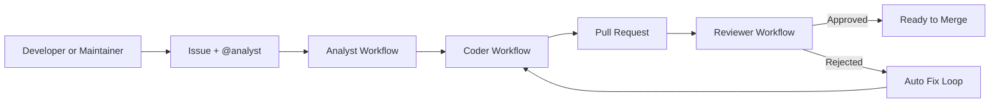
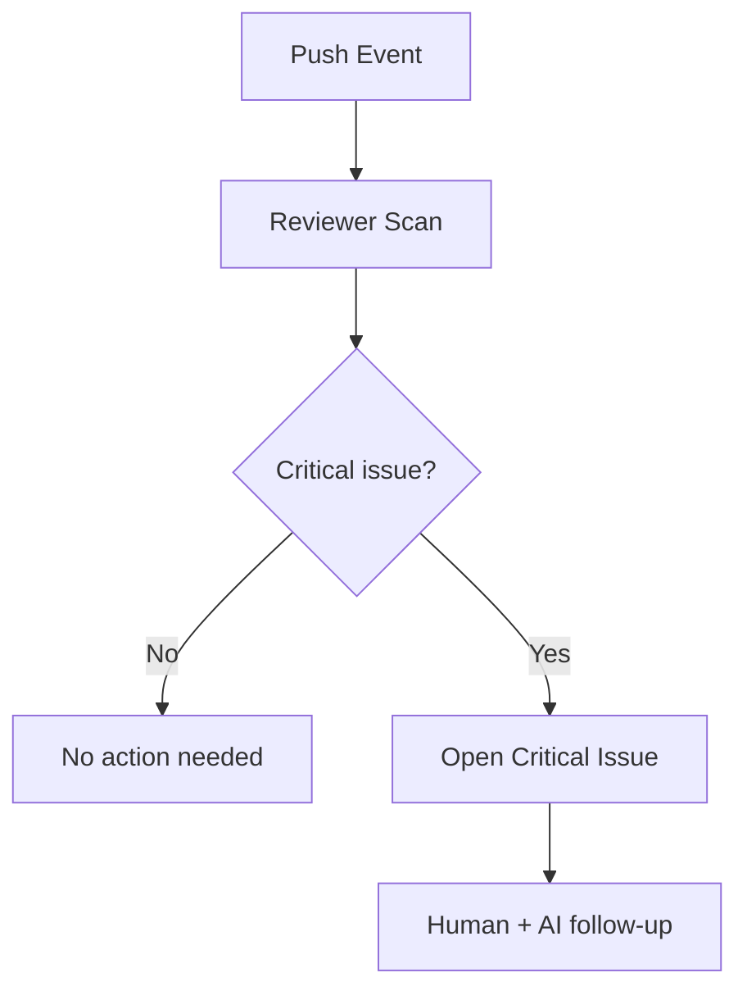

# HiveMind Actions

> Turn GitHub into an AI team: **Analyst plans**, **Coder builds**, **Reviewer protects quality**.

HiveMind Actions is a serverless multi-agent workflow for repositories that want faster delivery with automated review and self-correction.

## Quick Links

| Destination | Link | External visitor access |
|---|---|---|
| Repository | https://github.com/BUZASLAN128/HiveMind-Actions | Code, docs, tags, stars, forks |
| Actions Hub | https://github.com/BUZASLAN128/HiveMind-Actions/actions | All workflow runs and run history |
| Releases | https://github.com/BUZASLAN128/HiveMind-Actions/releases | Release notes and downloadable assets |
| Latest Tag | https://github.com/BUZASLAN128/HiveMind-Actions/releases/tag/v2.1.1 | Snapshot for latest tagged version |
| Analyst Workflow | https://github.com/BUZASLAN128/HiveMind-Actions/actions/workflows/agent-analyst.yml | Workflow definition + analyst run list |
| Coder Workflow | https://github.com/BUZASLAN128/HiveMind-Actions/actions/workflows/agent-coder.yml | Workflow definition + coder run list |
| Reviewer Workflow | https://github.com/BUZASLAN128/HiveMind-Actions/actions/workflows/agent-reviewer.yml | Workflow definition + reviewer run list |

Public visibility note: this repository is public, so outside visitors can open the links above directly.

### Where Analyst / Coder / Reviewer Pages Are Found

1. Open the repository home page.
2. Click the **Actions** tab.
3. In the left panel, select **Analyst Workflow**, **Coder Workflow**, or **Reviewer Workflow**.

## Live Workflow Status

## Why Teams Like It

- **Productivity:** Analyst-to-Coder handoff is automated.
- **Quality:** Reviewer checks every PR and blocks bad changes.
- **Security:** Push-level Beast Mode can create critical issues automatically.
- **Continuity:** Self-correction loop tries to fix rejected PRs before humans step in.

## How It Works (Simple)

```mermaid
flowchart LR
    U[Developer or Maintainer] --> I[Issue + @analyst]
    I --> A[Analyst Workflow]
    A --> C[Coder Workflow]
    C --> PR[Pull Request]
    PR --> R[Reviewer Workflow]
    R -->|Approved| M[Ready to Merge]
    R -->|Rejected| L[Auto Fix Loop]
    L --> C
```

## Auto Review on Every Push (Beast Mode)

Reviewer also runs on `push` (all branches), not only PRs.

```mermaid
flowchart TD
    P[Push Event] --> RV[Reviewer Scan]
    RV --> D{Critical issue?}
    D -- No --> OK[No action needed]
    D -- Yes --> IS[Open Critical Issue]
    IS --> HM[Human + AI follow-up]
```

This gives early warnings before risky code reaches production flow.

## Real PoC from This Repository

### Verified Self-Correction PoC (PR)

- PR #89 (merged): refactor with real-data test enforcement  
  https://github.com/BUZASLAN128/HiveMind-Actions/pull/89  
  Verified evidence in PR comments: reviewer triggered Jules loop (`Loop: 1/5`) and posted session continuity marker.

### Verified Auto-Review PoC (Push -> Critical Issue)

- Issue #91: Critical issue detected on commit `d6cd5d9`  
  https://github.com/BUZASLAN128/HiveMind-Actions/issues/91

- Issue #92: Critical issue detected on commit `8b39a2c`  
  https://github.com/BUZASLAN128/HiveMind-Actions/issues/92

- Issue #76: Earlier critical push detection example  
  https://github.com/BUZASLAN128/HiveMind-Actions/issues/76

### Additional Delivery Examples (Not loop evidence)

- PR #79 (merged): supply-chain hardening by pinning Jules action SHA  
  https://github.com/BUZASLAN128/HiveMind-Actions/pull/79

- PR #88 (merged): config + metrics integration for swarm agents  
  https://github.com/BUZASLAN128/HiveMind-Actions/pull/88

## 1-Minute Setup

1. Copy:
   - `.github/workflows/`
   - `.github/scripts/`
   - `.github/prompts/`
   - `.github/swarm_rules.md`
   - `.github/config.json`
2. Set secrets/vars in `Settings -> Secrets and variables -> Actions`.
3. Open issue and comment `@analyst`.

## Config You Need

| Name | Required | Purpose |
|---|---|---|
| `GLM_API_KEY` | Yes (if provider=`glm`) | GLM model access |
| `GEMINI_API_KEY` | Yes (if provider=`gemini`) | Gemini model access |
| `JULES_API_KEY` | Yes | Coder runs + reviewer self-correction |
| `APP_ID` | Optional | GitHub App identity |
| `APP_PRIVATE_KEY` | Optional | Pair for `APP_ID` |
| `SWARM_MODEL_PROVIDER` | Optional (`glm` default) | Active provider selector |

## Failure Recovery (Human-Readable)

### Retry and recovery behavior

- Core AI retry helper: **3 attempts** (exponential backoff + jitter).
- Analyzer AI call: **3 retries**.
- Reviewer AI call: **5 retries**.
- Reviewer self-correction loop: **max 5 cycles** (`Loop: n/5`).

### If automation cannot recover

- Missing `JULES_API_KEY` -> reviewer posts failure comment.
- Missing session continuity -> reviewer posts manual-action comment.
- Retry limit reached (`5/5`) -> loop stops and human intervention is requested.

### Exit behavior

- Fatal script-level errors exit with `sys.exit(1)`.
- Failed workflow steps are visible as failed GitHub Action jobs.

## Version and Release Policy

Current tags: `v2.0.0`, `v2.1.0`, `v2.1.1`.

Next prep target: **v2.2.0**.

- `MAJOR`: breaking behavior.
- `MINOR`: new capabilities.
- `PATCH`: fixes and reliability.

Release prep docs:

- `CHANGELOG.md`
- `RELEASE_CHECKLIST.md`

## Troubleshooting Fast

- Analyst not triggering: verify issue comment includes `@analyst` or `@analyze`.
- Coder not starting: check Analyst run has dispatch permission and valid payload.
- Reviewer loop not running: verify `JULES_API_KEY` and PR session markers.
- Too many failures: check if loop reached retry ceiling (`Max retries (5) reached`).

## FAQ

### GLM or Gemini?

- Use `glm` for the default coding-focused route.
- Use `gemini` if your team already standardizes on Gemini keys/workflows.

### Do I need GitHub App branding?

No. It works with default bot identity. GitHub App setup is optional.

## Contributing and Security

- Contribution guide: [CONTRIBUTING.md](CONTRIBUTING.md)
- Security policy: [SECURITY.md](SECURITY.md)
- License: [LICENSE](LICENSE)
