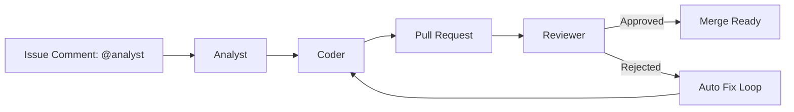
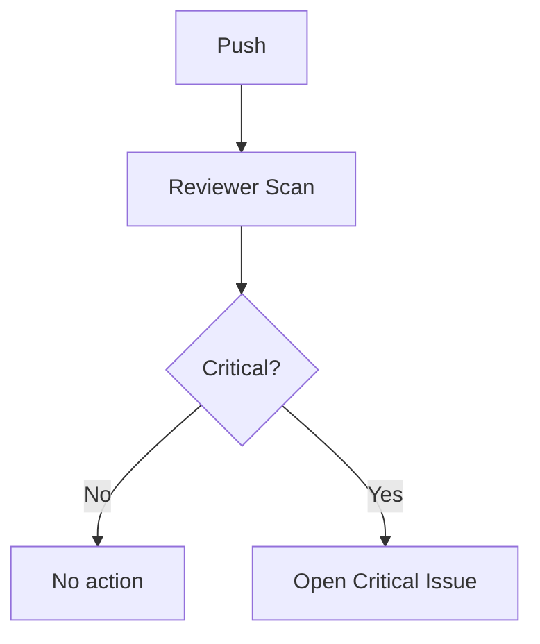

# HiveMind Actions

> The first serverless AI swarm for GitHub: **Analyst plans**, **Coder builds**, **Reviewer protects quality on PR and push**.

No servers, no bots to host, no custom runtime. Just GitHub Actions and your repo rules.

## Quick Access (Public)

| Where | Link |
|---|---|
| Repository | https://github.com/BUZASLAN128/HiveMind-Actions |
| Actions | https://github.com/BUZASLAN128/HiveMind-Actions/actions |
| Releases | https://github.com/BUZASLAN128/HiveMind-Actions/releases |
| Latest Tag | https://github.com/BUZASLAN128/HiveMind-Actions/releases/tag/v2.1.1 |
| Analyst Workflow | https://github.com/BUZASLAN128/HiveMind-Actions/actions/workflows/agent-analyst.yml |
| Coder Workflow | https://github.com/BUZASLAN128/HiveMind-Actions/actions/workflows/agent-coder.yml |
| Reviewer Workflow | https://github.com/BUZASLAN128/HiveMind-Actions/actions/workflows/agent-reviewer.yml |

Outside visitors can access these pages directly because this repository is public.

### Where people find Analyst / Coder / Reviewer pages

1. Open repository home page.
2. Click `Actions`.
3. Select `Analyst Workflow`, `Coder Workflow`, or `Reviewer Workflow` in the left panel.

## Why This Feels Different

- **Autonomous loop:** Reviewer can reject and trigger Coder fix attempts automatically.
- **Push protection:** Reviewer also runs on push and can open critical issues.
- **Rule-driven behavior:** Agents follow your `.github/swarm_rules.md`.
- **No infra overhead:** Everything runs on standard GitHub Actions runners.

## How It Works

```mermaid
flowchart LR
    U[Issue Comment: @analyst] --> A[Analyst]
    A --> C[Coder]
    C --> PR[Pull Request]
    PR --> R[Reviewer]
    R -->|Approved| M[Merge Ready]
    R -->|Rejected| F[Auto Fix Loop]
    F --> C
```

## Auto Review on Every Push

Reviewer workflow listens to both `pull_request` and `push` events.

```mermaid
flowchart TD
    P[Push] --> S[Reviewer Scan]
    S --> D{Critical?}
    D -- No --> N[No action]
    D -- Yes --> I[Open Critical Issue]
```

This means risky changes can be flagged before they reach release flow.

## Proof of Work from This Repo

### Verified self-correction PoC

- PR #89 (merged): reviewer triggered Jules correction loop (`Loop: 1/5`)  
  https://github.com/BUZASLAN128/HiveMind-Actions/pull/89

### Verified push-level critical detection

- Issue #91 (critical issue from push): https://github.com/BUZASLAN128/HiveMind-Actions/issues/91
- Issue #92 (critical issue from push): https://github.com/BUZASLAN128/HiveMind-Actions/issues/92
- Issue #76 (earlier push detection example): https://github.com/BUZASLAN128/HiveMind-Actions/issues/76

### Additional delivery examples

- PR #79 (supply-chain hardening): https://github.com/BUZASLAN128/HiveMind-Actions/pull/79
- PR #88 (config + metrics integration): https://github.com/BUZASLAN128/HiveMind-Actions/pull/88

## 1-Minute Setup

1. Copy:
   - `.github/workflows/`
   - `.github/scripts/`
   - `.github/prompts/`
   - `.github/swarm_rules.md`
   - `.github/config.json`
2. Set Actions secrets and variables in `Settings -> Secrets and variables -> Actions`.
3. Open an issue and comment `@analyst`.

## Config Matrix (Source of Truth)

| Name | Required | Used by | Purpose |
|---|---|---|---|
| `GLM_API_KEY` | Yes if provider=`glm` | Analyst, Reviewer | GLM model API access |
| `GEMINI_API_KEY` | Yes if provider=`gemini` | Analyst, Reviewer | Gemini model API access |
| `JULES_API_KEY` | Yes | Coder, Reviewer loop | Code execution + self-correction |
| `APP_ID` | Optional | Analyst, Reviewer | GitHub App identity |
| `APP_PRIVATE_KEY` | Optional | Analyst, Reviewer | Pair key for `APP_ID` |
| `SWARM_MODEL_PROVIDER` | Optional (`glm` default) | All | Provider selector (`glm` or `gemini`) |

## Failure Recovery (Simple)

- Core AI helper retries: **3 attempts**.
- Analyst AI retries: **3**.
- Reviewer AI retries: **5**.
- Self-correction loop max: **5 cycles** (`Loop: n/5`).
- Fatal script failures stop with `sys.exit(1)`.

If auto recovery cannot finish:

- missing `JULES_API_KEY` -> reviewer posts failure comment,
- missing session marker -> reviewer asks for manual intervention,
- retry ceiling reached -> loop stops and human follow-up is required.

## Version and Release Policy

Current tags: `v2.0.0`, `v2.1.0`, `v2.1.1`  
Next planned minor: `v2.2.0`

SemVer policy:

- `MAJOR`: breaking changes
- `MINOR`: new capabilities
- `PATCH`: bugfix/reliability updates

Release preparation references:

- `CHANGELOG.md`
- `RELEASE_CHECKLIST.md`

## Troubleshooting

- Analyst not triggering: issue comment must include `@analyst` or `@analyze`.
- Coder not starting: check analyst dispatch step and permissions.
- Reviewer loop not running: verify `JULES_API_KEY` and PR session markers.
- Too many failures: check if max retry (`5`) was reached.

## FAQ

### GLM or Gemini?

- Use `glm` for default coding flow.
- Use `gemini` if your team already uses Gemini credentials and policies.

### Is GitHub App branding required?

No. Default bot identity works. `APP_ID` and `APP_PRIVATE_KEY` are optional.

## Contributing and Security

- Contribution guide: [CONTRIBUTING.md](CONTRIBUTING.md)
- Security policy: [SECURITY.md](SECURITY.md)
- Changelog: [CHANGELOG.md](CHANGELOG.md)
- License: [LICENSE](LICENSE)
