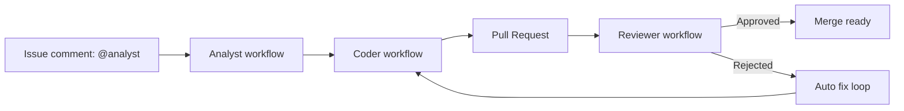
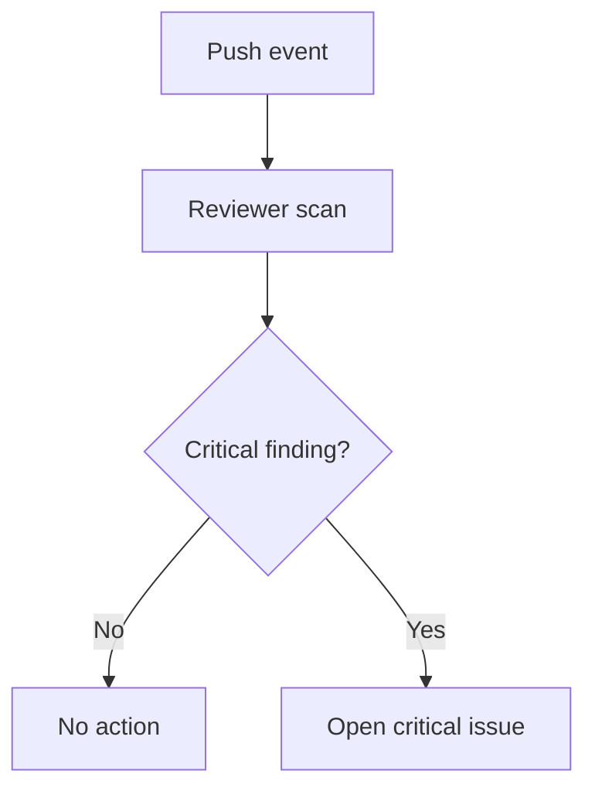

# HiveMind Actions

<b>Serverless AI swarm for GitHub: Analyst plans, Coder builds, Reviewer protects quality on PR and push.</b>

No servers. No always-on bot infra. Just GitHub Actions.

  
  
  

  
  
  

  <a href="https://github.com/BUZASLAN128/HiveMind-Actions/actions"><b>View Actions</b></a> |
  <a href="https://github.com/BUZASLAN128/HiveMind-Actions/pull/89"><b>See Self-Correction PoC</b></a> |
  <a href="https://github.com/BUZASLAN128/HiveMind-Actions/issues/76"><b>See Push Review PoC</b></a> |
  <a href="https://github.com/BUZASLAN128/HiveMind-Actions/releases"><b>Releases</b></a>

## Why This Product

HiveMind turns GitHub events into an autonomous delivery loop:

- Analyst transforms issue intent into execution plan.
- Coder implements and opens PR.
- Reviewer enforces standards and blocks risky changes.
- Reviewer can trigger self-correction to Coder until quality is acceptable.

## What You Get in Practice

| Capability | Why it matters |
|---|---|
| Self-correction loop | Reviewer can reject and trigger Coder fixes (`Loop: n/5`) before human rework grows. |
| Push-level protection | Reviewer also runs on push and can open critical issues early. |
| Rule-driven output | Agent behavior follows your `.github/swarm_rules.md`. |
| Serverless runtime | Uses standard GitHub Actions runners only. |

## Live Proof from This Repository

### Verified self-correction

- PR #89 (merged): reviewer loop evidence (`Loop: 1/5`)  
  https://github.com/BUZASLAN128/HiveMind-Actions/pull/89

### Verified push-level critical detection

- Issue #76: https://github.com/BUZASLAN128/HiveMind-Actions/issues/76
- Issue #75: https://github.com/BUZASLAN128/HiveMind-Actions/issues/75
- Issue #11: https://github.com/BUZASLAN128/HiveMind-Actions/issues/11

Note: examples above are selected from reviewer findings with real code-review output (not balance/quota failures).

### Additional delivery examples

- PR #79 (supply-chain hardening): https://github.com/BUZASLAN128/HiveMind-Actions/pull/79
- PR #88 (config + metrics): https://github.com/BUZASLAN128/HiveMind-Actions/pull/88

## Quick Access (Public)

This repo is public, so outside visitors can open all links below directly.

| Destination | Link |
|---|---|
| Repository | https://github.com/BUZASLAN128/HiveMind-Actions |
| Actions Hub | https://github.com/BUZASLAN128/HiveMind-Actions/actions |
| Releases | https://github.com/BUZASLAN128/HiveMind-Actions/releases |
| Latest Tag | https://github.com/BUZASLAN128/HiveMind-Actions/releases/tag/v2.1.1 |
| Analyst Workflow | https://github.com/BUZASLAN128/HiveMind-Actions/actions/workflows/agent-analyst.yml |
| Coder Workflow | https://github.com/BUZASLAN128/HiveMind-Actions/actions/workflows/agent-coder.yml |
| Reviewer Workflow | https://github.com/BUZASLAN128/HiveMind-Actions/actions/workflows/agent-reviewer.yml |

### Where outsiders find Analyst / Coder / Reviewer

1. Open repository home page.
2. Click `Actions`.
3. Select `Analyst Workflow`, `Coder Workflow`, or `Reviewer Workflow` in the left panel.

## 1-Minute Quickstart

1. Copy these paths into your repository:
   - `.github/workflows/`
   - `.github/scripts/`
   - `.github/prompts/`
   - `.github/swarm_rules.md`
   - `.github/config.json`
2. Add Actions secrets and variables from `Settings -> Secrets and variables -> Actions`.
3. Open an issue and comment `@analyst`.

## How Swarm Runs

```mermaid
flowchart LR
    U[Issue comment: @analyst] --> A[Analyst workflow]
    A --> C[Coder workflow]
    C --> PR[Pull Request]
    PR --> R[Reviewer workflow]
    R -->|Approved| M[Merge ready]
    R -->|Rejected| L[Auto fix loop]
    L --> C
```

## Auto Review on Every Push

Reviewer runs on both `pull_request` and `push`.

```mermaid
flowchart TD
    P[Push event] --> S[Reviewer scan]
    S --> D{Critical finding?}
    D -- No --> N[No action]
    D -- Yes --> I[Open critical issue]
```

## Operational Details

<b>Configuration Matrix (source of truth)</b>

| Name | Required | Used by | Purpose |
|---|---|---|---|
| `GLM_API_KEY` | Yes if provider=`glm` | Analyst, Reviewer | GLM model API access |
| `GEMINI_API_KEY` | Yes if provider=`gemini` | Analyst, Reviewer | Gemini model API access |
| `JULES_API_KEY` | Yes | Coder, Reviewer loop | Code execution + self-correction |
| `APP_ID` | Optional | Analyst, Reviewer | GitHub App identity |
| `APP_PRIVATE_KEY` | Optional | Analyst, Reviewer | Pair key for `APP_ID` |
| `SWARM_MODEL_PROVIDER` | Optional (`glm` default) | All | Provider selector (`glm` or `gemini`) |

<b>Failure recovery and retry policy</b>

- Core AI helper retries: **3 attempts**.
- Analyst AI retries: **3**.
- Reviewer AI retries: **5**.
- Self-correction max loop: **5 cycles** (`Loop: n/5`).
- Fatal script errors stop with `sys.exit(1)`.

If automation cannot recover:

- missing `JULES_API_KEY` -> reviewer posts failure comment,
- missing session marker -> reviewer asks manual intervention,
- retry ceiling reached -> loop stops and human follow-up is required.

## Version and Release Policy

Current tags: `v2.0.0`, `v2.1.0`, `v2.1.1`  
Next planned minor: `v2.2.0`

SemVer:

- `MAJOR`: breaking changes
- `MINOR`: new capabilities
- `PATCH`: bugfix/reliability updates

Release references:

- `CHANGELOG.md`
- `RELEASE_CHECKLIST.md`

## Troubleshooting

- Analyst not triggering: issue comment must include `@analyst` or `@analyze`.
- Coder not starting: check analyst dispatch permissions and payload.
- Reviewer loop not running: verify `JULES_API_KEY` and PR session markers.
- Repeated failures: verify if max retry (`5`) was reached.

## FAQ

### GLM or Gemini?

- Use `glm` for default coding flow.
- Use `gemini` if your organization already uses Gemini credentials/policies.

### Is GitHub App branding required?

No. Default bot identity works. `APP_ID` and `APP_PRIVATE_KEY` are optional.

## Contributing and Security

- Contribution guide: [CONTRIBUTING.md](CONTRIBUTING.md)
- Security policy: [SECURITY.md](SECURITY.md)
- Changelog: [CHANGELOG.md](CHANGELOG.md)
- License: [LICENSE](LICENSE)
