# 🧠 HiveMind Actions 2.0 (Evolutionary Edition)

> **The First "Serverless" Swarm AI for GitHub Actions.**  
> Turn your repository into a self-healing, multi-agent AI workspace with zero infrastructure cost.

[](https://github.com/BUZASLAN128/HiveMind-Actions/issues/1) 
[](https://github.com/BUZASLAN128/HiveMind-Actions/pull/32) 

---

## 🌟 What is this?
**HiveMind** is not just a bot. It's a **collaborative AI Swarm** that lives inside your GitHub Actions. 
It enables a team of specialized AI agents to work together, autonomously planning, architecting, coding, reviewing, and **evolving the codebase** without your intervention.

Think of it as having a **full engineering team**—including a Strategist, Architect, and a ruthless Gatekeeper—working 24/7 on your repo, for free.

---

## 🔥 Why HiveMind? (Killer Features)

### 1. ♾️ Autonomous Self-Correction & Evolution
The most powerful feature. If the **Gatekeeper** (Reviewer) finds a flaw:
1. It **REJECTS** the PR with actionable feedback.
2. It triggers the **Coder** to fix its own mistakes.
3. This loop continues until the code meets the **9/10 Quality Standard**.
4. The swarm also proactively seeks to improve and refactor the code, guided by the **Strategist**.

### 2. 📜 Constitutional AI (HIVEMIND_DIRECTIVES.md)
HiveMind operates based on a "constitution" you define in `.github/HIVEMIND_DIRECTIVES.md`.
- **Your Rules, Their Law:** Define architectural principles, coding standards, and performance metrics.
- **Strict Enforcement:** The Gatekeeper agent ruthlessly enforces these rules on every commit and pull request.

### 3. 🛡️ God Mode (Proactive Engineering)
HiveMind doesn't wait for issues; it hunts for them.
- **Nightly Scans:** The **Strategist** scans the codebase every night to identify "Refactoring Candidates."
- **Auto-Generated Tasks:** It autonomously opens issues for performance bottlenecks, tech debt, and potential bugs.

### 4. ⚡ Competitive Intelligence (Smart Actions)
- **Smart Ignore:** Automatically skips junk files (`package-lock.json`, `dist/`, `*.min.js`) to save tokens and reduce noise.
- **Auto-Labeler:** AI analyzes your PR and tags it automatically (`bug`, `feature`, `security`, `refactor`).
- **Token Optimization:** Uses efficient diff parsing to handle large PRs without breaking the bank.

### 5. 🚀 Zero-Config (Serverless)
No servers to manage. No Docker containers to host.
- Runs entirely on **GitHub Actions runners**.
- Uses **Google Gemini 2.0 Flash** (Fast & Free).
- Just copy the workflow files and you're done.

---

## 🤖 The Swarm Agents (v2.0 Structure)

| Agent | Icon | Role | Superpower |
|---|---|---|---|
| **Strategist** | 🧠 | Visionary | Analyzes the entire codebase, finds bottlenecks, and creates high-level tasks. |
| **Analyst** | 🔍 | Architect | Breaks down complex issues into the smallest atomic steps. |
| **Architect**| 🛠️ | Designer | Chooses the optimal design pattern before any code is written. |
| **Coder** | 🤖 | Executor | Writes pristine code, tests, and documentation. |
| **Gatekeeper**| 🛡️ | Quality Control | Ruthlessly rejects any PR that fails to meet the 9/10 standard. |

### 🔄 The HiveMind Workflow: How Agents are Triggered

The HiveMind Swarm operates in a sequential, predictable, and centralized manner to ensure stability and prevent redundant operations. Here’s how the agents collaborate:

1.  **🧠 Strategist & Analyst (`agent-analyst.yml`)**
    *   **Trigger:** A user with write-access posts a comment containing `@analyst` or `@analyze` on an issue, or a nightly scheduled run.
    *   **Action:** The Strategist and Analyst assess the issue or codebase, gather context, and create a detailed implementation plan.
    *   **Output:** They trigger the Coder Agent by dispatching a `workflow_dispatch` event.

2.  **🤖 Coder Agent (`agent-coder.yml`)**
    *   **Trigger:** Receives a `workflow_dispatch` event exclusively from the Analyst Agent.
    *   **Action:** The Coder executes the plan, writes code, runs tests, and opens a pull request.
    *   **Output:** A pull request ready for review.

3.  **🛡️ Gatekeeper (`agent-reviewer.yml`)**
    *   **Trigger:** A pull request is `opened`, `synchronize`d (a new commit is pushed), or marked `ready_for_review`.
    *   **Action:** The Gatekeeper inspects the code changes against the project's directives (`HIVEMIND_DIRECTIVES.md`).
    *   **Output:**
        *   **If Approved:** The pull request is approved and can be merged.
        *   **If Rejected:** The Gatekeeper initiates the **Self-Correction Loop**, sending feedback directly to the Coder Agent to fix the issues automatically.

```mermaid
graph TD
    subgraph "Step 1: Analysis & Strategy"
        A["👤 User posts '@analyze' or<br>🕒 Nightly Schedule"] --> B["[agent-analyst.yml]<br>🧠 Strategist & 🔍 Analyst"];
    end
    subgraph "Step 2: Coding"
        B -- "Triggers Coder via workflow_dispatch" --> C["[agent-coder.yml]<br>🤖 Coder Agent"];
        C -- "Opens a Pull Request" --> D;
    end
    subgraph "Step 3: Review & Self-Correction"
        D["[agent-reviewer.yml]<br>🛡️ Gatekeeper (Reviewer)"] -- "Inspects PR" --> E{"Verdict?"};
        E -- "✅ Approved (Score >= 9/10)" --> F["PR Merged"];
        E -- "❌ Rejected" --> G["Self-Correction Loop<br>(Gatekeeper tells Coder to fix it)"];
        G --> C;
    end
```



---

## 🛠️ Installation

### Step 1: Clone the Brain
Copy these folders and files to your repository:
```bash
.github/workflows/
.github/scripts/
.github/prompts/
.github/HIVEMIND_DIRECTIVES.md
```

### Step 2: Add Secrets
Go to **Settings > Secrets and variables > Actions** and add:
- `GEMINI_API_KEY`: Your Google Gemini API Key.
- `JULES_API_KEY`: API Key for the Coder Agent trigger.

### Step 3: Define Your Constitution
Edit `.github/HIVEMIND_DIRECTIVES.md` to set your project's rules and standards.

---

## 🎨 Bot Customization & Branding

Want your AI to look professional? You can customize the bot's identity.

### Option A: Zero Config (Default)
Uses the standard `github-actions[bot]`.
- **Pros:** No setup required.
- **Cons:** Generic avatar.

### Option B: Custom Brand (Pro)
Use your own App Name and Logo (e.g., `EnesBot`).

1. Create a [GitHub App](https://github.com/settings/apps/new)
2. Permissions: `Contents: Read & Write`, `Issues: Read & Write`, `Pull Requests: Read & Write`
3. Generate **Private Key** and get **App ID**.
4. Add Secrets: `APP_ID` and `APP_PRIVATE_KEY`.

**Result:** Your bot comments with **your logo** and name.

---

## 🤝 Contributing & Support
We love community contributions!
- See [CONTRIBUTING.md](CONTRIBUTING.md) for guidelines.
- **Rules:** All PRs must pass the AI Gatekeeper's checks.
- **Contact:** [buzaslan.ea@gmail.com](mailto:buzaslan.ea@gmail.com)

---

## 📜 License
MIT - Free to fork, free to use, free to conquer.
